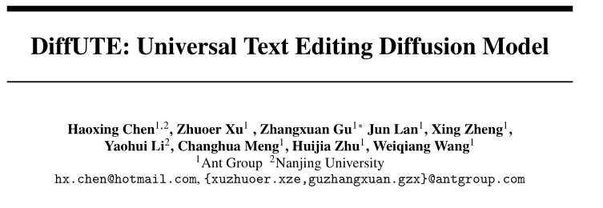
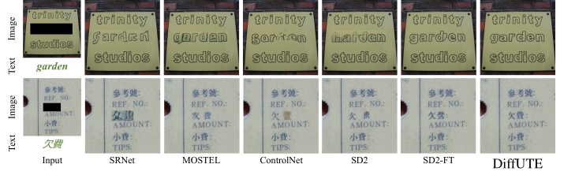

<!--
Presenter's notes:
- This is a Marp presentation (Markdown-based slides).
- Use `---` to separate slides.
- You can add speaker notes in HTML comments like this one.
-->

# **Anonymization of Sensitive Information in Financial Documents**  
**Using Python, Diffusion Models, and Named Entity Recognition**

**Speaker**: Dr Piotr Gryko

---

# **Overview**

- **Why anonymize financial documents?**  
  - Compliance with privacy laws (GDPR, HIPAA, etc.)  
  - Protect sensitive client data  
  - Facilitate internal analytics without exposing real PII  

- **Key Techniques**  
  1. Named Entity Recognition (NER) for PII detection  
  2. Masking or synthetic replacement for anonymization  
  3. Diffusion models for advanced inpainting (images/text)  

---

# **Data as Fuel**  

- **Data = "Fossil Fuel"** of Machine Learning  
  - Essential for training high-quality models  
  - Often locked away due to privacy restrictions

- **Goal**  
  - Use real documents **without** exposing actual personal data  
  - **Replace** sensitive data with realistic stand-ins  
  - Maintain structure and context for valid ML training  

---

# **Challenges of Using ChatGPT**  

- **Hallucinations**: Large language models can introduce factual errors  
- **Inconsistency**: Repeated queries might yield different anonymizations  

**Solution**:  
- Self-hosted open-source tools (SpaCy, NLTK, PyTorch, etc.)  
- Consistent, customizable pipelines  
- Infilling using specilised diffusion models 

---

# **High-Level Approach**

1. **Identify Sensitive Entities**  
   - Names, addresses, account numbers, SSNs, etc.  
   - Use Named Entity Recognition (NER)

2. **Anonymize or Replace**  
   - Simple: Mask entities with placeholders (`<NAME>`, `<ACCOUNT>`)  
   - Advanced: Generate synthetic but realistic replacements

3. **(Optionally) Use Diffusion Models**  
   - Inpaint text or images for realistic fill-ins  
   - Keep the document’s visual or textual consistency  

---

# **Named Entity Recognition (NER)**

- **Definition**:  
  - Automatically identifying and classifying named entities (e.g., PERSON, ORG, LOCATION)

- **Libraries**:
  - **SpaCy**: Fast, easily customizable, good pre-trained pipelines  
  - **NLTK**: Classic, robust for general NLP tasks  
  - **PyTorch**: Build custom deep learning models for domain-specific needs  

---

# **SpaCy NER Example**

```python
import spacy

# Load a pre-trained NER model
nlp = spacy.load("en_core_web_sm")

text = "John Doe has an account number 1234-5678-9101 at ABC Bank."
doc = nlp(text)

for ent in doc.ents:
    print(ent.text, ent.label_)
```

- Outputs named entities like `John Doe (PERSON)`, `ABC Bank (ORG)`, etc.  

---

# **Simple Anonymization**

```python
anonymized_text = text
for ent in reversed(doc.ents):
    start, end = ent.start_char, ent.end_char
    placeholder = f"<{ent.label_}>"
    anonymized_text = anonymized_text[:start] + placeholder + anonymized_text[end:]

print(anonymized_text)
# "<PERSON> has an account number <CARDINAL> at <ORG>."
```

- **Pros**: Quick and easy  
- **Cons**: Loses natural structure and context (sometimes needed for model training)  

---

# **Synthetic Replacements**

- **Why?**  
  - Preserves format/length (e.g., valid credit card pattern)  
  - Maintains a semblance of realism for training or software testing

- **Approaches**:  
  1. **Rule-Based**: Randomly generate valid-looking strings (e.g., `4000-1234-5678-9999`)  
  2. **Generative Models**: Use a trained model to produce realistic text (names, addresses, etc.)  

---

# **Text vs. Image Documents**

- **Text Documents** (Word, PDF with embedded text)  
  - Easier to process with direct NER, tokenization, etc.  
  - “Inpainting” can mean replacing tokens in context  

- **Image/Scanned PDFs**  
  - Requires **OCR** (Tesseract, EasyOCR) for text extraction  
  - Then apply NER  
  - Use **image inpainting** if you need to maintain the look of the scanned doc  

---

# **Diffusion Models for Inpainting**

**What are Diffusion Models?**  
- Generative models that learn to **denoise** data  
- Typically used for **image** generation, but concept extends to text inpainting

**Workflow**:  
1. Mask region containing PII  
2. Use diffusion or a similar generative approach to fill in with synthetic data  
3. Maintain visual/textual consistency so the anonymized doc looks natural  

---

# **Limitations of Native Application of Diffusion Models for Inpainting**

- **Text Style Complexity**:  
    - Difficulty capturing and replicating fine-grained text styles (font, color, orientation)  
    - Limited ability to handle complex multilingual text, especially non-Latin scripts  

- **Background Consistency**:  
    - Challenges maintaining natural background appearance when editing text  
    - Particularly problematic in intricate or cluttered scenes  

---


1. **Glyph Control**:
   - Incorporates glyph embeddings to guide the model on character shape and style.
   - Enables accurate and diverse text generation across multiple languages.
2. **Fine-grained Guidance**:
   - Position and glyph information ensure precise replication of text style.
---

# **DiffUTE beats other methods with a significant improvement**


---

# **Practical Considerations**

- **Model Accuracy**:  
  - Domain-specific training needed for financial documents  
  - Regular updates to capture new entity types (e.g., new IBAN formats)

- **Performance**:  
  - Large-scale docs? Ensure your pipeline is efficient  
  - Generative models can be resource-heavy  

- **Compliance & Governance**:  
  - Maintain logs of anonymization for auditing  
  - Ensure synthetic approach isn’t reversible (avoid re-identification)  

---

# **Limitations & Edge Cases**

- **Misspellings / Obfuscations**:  
  - NER might miss “J0hn D0e” or unusual patterns  
  - Combine rule-based checks with NER for better coverage  

- **Diffute requires training on a dataset**
---

# **Conclusion**

- **Takeaways**:  
  1. **Use NER** to systematically identify sensitive entities  
  2. **Mask or Generate** synthetic replacements to protect privacy  
  3. **Leverage Python’s open-source ecosystem** (SpaCy, NLTK, PyTorch) for self-hosted, consistent pipelines  
  4. **Specilised Diffusion Models** can help with realistic inpainting for more complex use cases  

- **Q&A**:  
  - “Thank you for your attention! Let’s discuss your questions.”

---

# **References & Resources**

- **SpaCy**: [https://spacy.io](https://spacy.io)  
- **NLTK**: [https://www.nltk.org](https://www.nltk.org)  
- **PyTorch**: [https://pytorch.org](https://pytorch.org)  
- **Diffusion Models**:  
  - [Stable Diffusion](https://github.com/huggingface/diffusers)
  - [SD2-FT](https://openreview.net/pdf/2a9aeb508da2f865f04149b36c039816032b1461.pdf)
  - [Diffute](https://arxiv.org/pdf/2305.10825)

---

<!--
Speaker’s closing note:
- Encourage audience to try building a simple pipeline with SpaCy or NLTK.
- If time permits, do a quick live code demo or share a GitHub repo link.
-->

Thank you! 